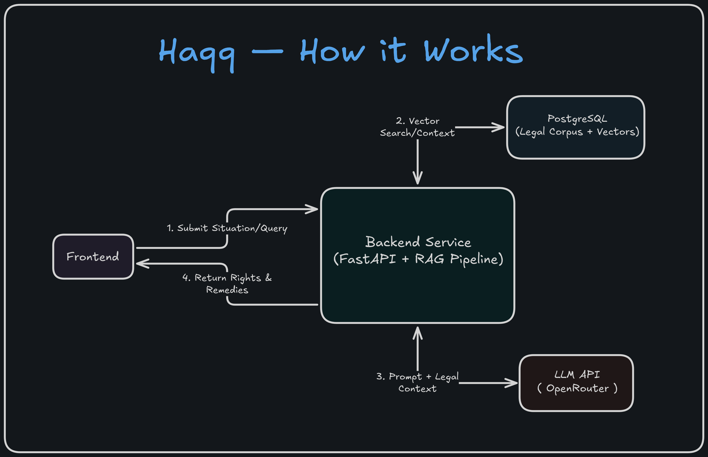

<div align="center">
  
  <p>Free legal rights advisor for India.<br/>Describe your situation in plain language — get your rights, remedies, and citations in seconds.</p>

  <a href="https://tryhaqq.vercel.app">🔗 tryhaqq.vercel.app</a>


</div>



## How It Works

1. User describes their situation in plain language
2. **Classifier** (LLM) identifies the legal domain — e.g. `labour`, `consumer`, `rti`
3. **Retriever** runs hybrid search — 70% vector similarity (pgvector) + 30% keyword match (tsvector)
4. **Analyzer** (LLM) generates rights, remedies, and law citations from the retrieved sections
5. Response streams token-by-token to the frontend via Server-Sent Events

## Stack

| Layer      | Tech                                                    |
| ---------- | ------------------------------------------------------- |
| Backend    | FastAPI, Python 3.12                                    |
| Database   | PostgreSQL 16 + pgvector                                |
| Embeddings | `BAAI/bge-small-en-v1.5` via fastembed (local, ~130 MB) |
| LLM        | OpenRouter                                              |
| Caching    | TTLCache in-memory, 6h TTL                              |
| Frontend   | React 19, TypeScript, Vite, Tailwind CSS                |

## Local Development

**Prerequisites:** Python 3.12+, Node.js 22+, Docker, [OpenRouter API key](https://openrouter.ai)

```bash
git clone https://github.com/Alokxk/Haqq.git
cd Haqq
cp .env.example .env
# Fill in OPENROUTER_API_KEY in .env
```

```bash
# Start database
docker compose up -d

# Backend
python3.12 -m venv venv
source venv/bin/activate   # Windows: venv\Scripts\activate
pip install -r requirements.txt

# Frontend
cd frontend && npm install && cd ..
```

```bash
# Corpus — run once to ingest and embed
python corpus/ingest.py
python corpus/embed.py
```

```bash
# Terminal 1 — backend
source venv/bin/activate && uvicorn main:app --reload --port 8000

# Terminal 2 — frontend
cd frontend && npm run dev
```

Open [http://localhost:5173](http://localhost:5173)

## Corpus

1,420 sections across 8 central Indian acts sourced from [indiacode.nic.in](https://indiacode.nic.in):

- Payment of Wages Act, 1936
- Right to Information Act, 2005
- Consumer Protection Act, 2019
- POSH Act, 2013
- Indian Penal Code, 1860
- Code of Criminal Procedure, 1973
- Negotiable Instruments Act, 1881
- Delhi Rent Control Act, 1958

---

_Haqq is not a substitute for legal advice. For court proceedings, consult a registered advocate._
