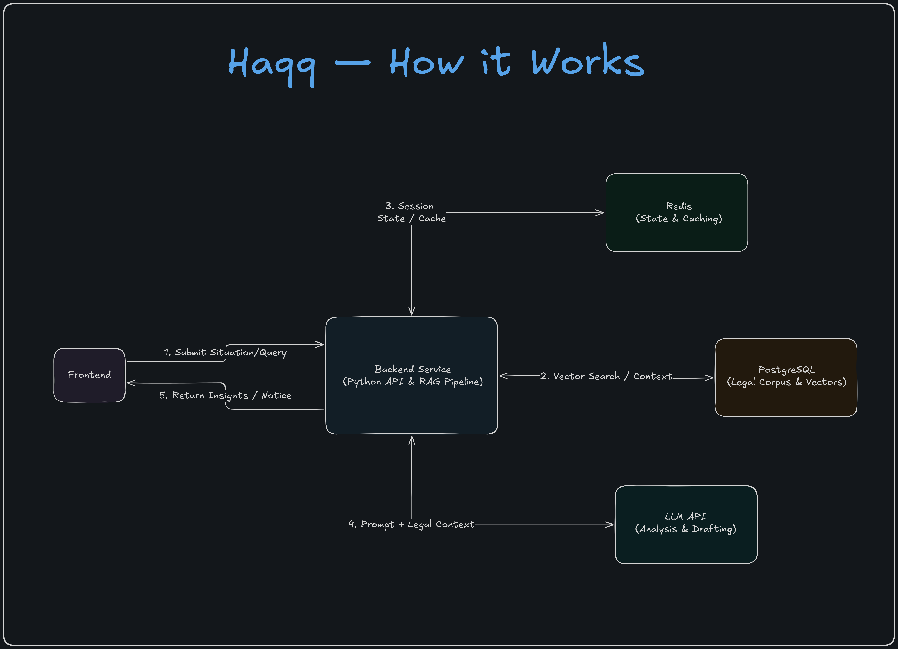

# Haqq

**Legal rights advisor for India.** Describe your situation in plain language — Haqq searches 1,420+ sections across 8 Indian acts, finds what applies, and tells you exactly what to do. With citations, step-by-step remedies, and a downloadable legal notice. Free. No signup.




## How It Works

1. User describes their situation in the React frontend
2. FastAPI classifies it (LLM → domain + sub-domain, e.g. `labour / unpaid wages`)
3. Retriever runs hybrid search across 1,420+ law sections — scored by vector similarity (70%) and keyword match (30%)
4. Analyzer (LLM) generates rights, remedies, and law citations from the top retrieved chunks
5. Result is saved to PostgreSQL, a shareable URL is returned — response in ~10–15s
6. If a legal notice is requested, an RQ background worker generates the PDF — the API returns immediately and the frontend polls for completion

## Architecture

Key decisions:

- **Hybrid retrieval** — pure vector search misses exact legal terms (section numbers, act names). Combining pgvector cosine similarity with PostgreSQL tsvector keyword scoring gives meaningfully better results
- **Local embeddings** — `intfloat/multilingual-e5-large` runs via fastembed with no external API call per query. The ~2.2 GB model is downloaded once and cached; embeddings cost nothing at runtime
- **asyncio.to_thread** — psycopg2 (sync) and fastembed (sync) are called from async FastAPI handlers via `asyncio.to_thread` to avoid blocking the event loop
- **RQ + Redis** — PDF generation runs in a background worker so the `/draft` endpoint returns immediately. Frontend polls `/draft/:id/download` every 2s until the file is ready
- **202 + polling** instead of WebSockets — generation takes 3–10s, polling at 2s is simpler and sufficient

## Corpus

1,420+ sections across 8 central Indian acts:

- Payment of Wages Act, 1936
- Right to Information Act, 2005
- Consumer Protection Act, 2019
- POSH Act, 2013
- Indian Penal Code, 1860
- CrPC, 1973
- Negotiable Instruments Act, 1881
- Delhi Rent Control Act, 1958

Source: [indiacode.nic.in](https://indiacode.nic.in) — Government of India

## Limitations

- Covers 8 central Indian acts only — state laws, labour tribunals, family law, and property disputes are not in scope
- PDF notices are templates — review content before sending
- LLM returns a fallback response if confidence is too low to give reliable advice

## Stack

| Layer      | Tech                                                          |
| ---------- | ------------------------------------------------------------- |
| Backend    | FastAPI, Python 3.12                                          |
| Database   | PostgreSQL + pgvector                                         |
| Embeddings | FastEmbed · `intfloat/multilingual-e5-large` (local, ~2.2 GB) |
| LLM        | OpenRouter                                                    |
| Queue      | Redis + RQ                                                    |
| PDF        | ReportLab                                                     |
| Frontend   | React 19 + TypeScript + Vite + Tailwind CSS                   |

## Local Development

**Prerequisites:** Python 3.12+, Node.js 22+, Docker, [OpenRouter API key](https://openrouter.ai)

```bash
# Clone and configure
git clone https://github.com/Alokxk/Haqq.git
cd Haqq
cp .env.example .env
# Edit .env:
#   OPENROUTER_API_KEY  — your key from openrouter.ai
#   OPENROUTER_MODEL    — any model from openrouter.ai
#   PUBLIC_URL          — set to your frontend domain in production (default: http://localhost:5173)

# Start postgres and redis
docker compose up -d

# Backend
python3.12 -m venv venv
source venv/bin/activate        # Windows: venv\Scripts\activate
pip install -r requirements.txt

# Frontend
cd frontend && npm install && cd ..
```

**Corpus** — Add source PDFs to `corpus/sources/raw/` and run:

```bash
python -m corpus.ingest   # chunk and store
python -m corpus.embed    # generate embeddings (~2.2 GB model downloads on first run)
```

> Without the corpus the API still runs, but returns fallback responses.

**Run (3 terminals):**

```bash
# Terminal 1 — backend
source venv/bin/activate && uvicorn main:app --reload --port 8000

# Terminal 2 — PDF worker
source venv/bin/activate && rq worker haqq --url redis://localhost:6379/0

# Terminal 3 — frontend
cd frontend && npm run dev
```

Open [http://localhost:5173](http://localhost:5173)

---

_Haqq is not a substitute for legal advice. For court proceedings, consult a registered advocate._
